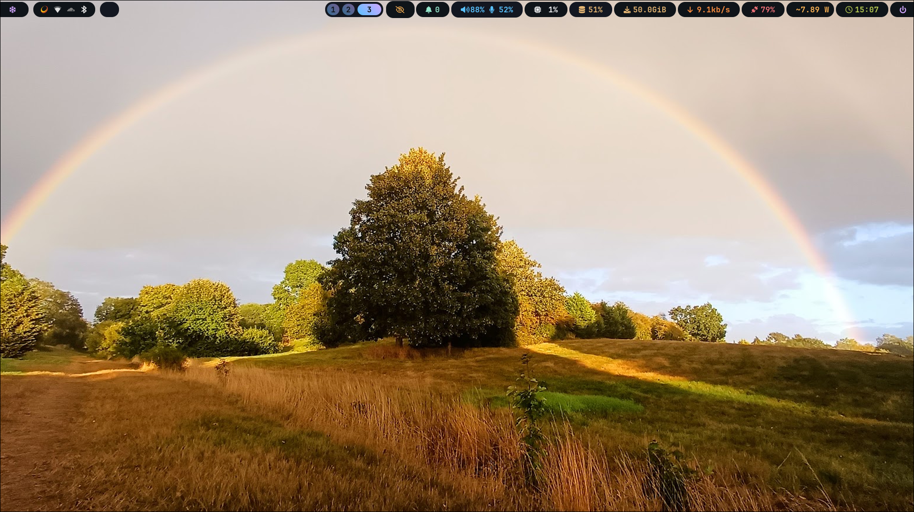
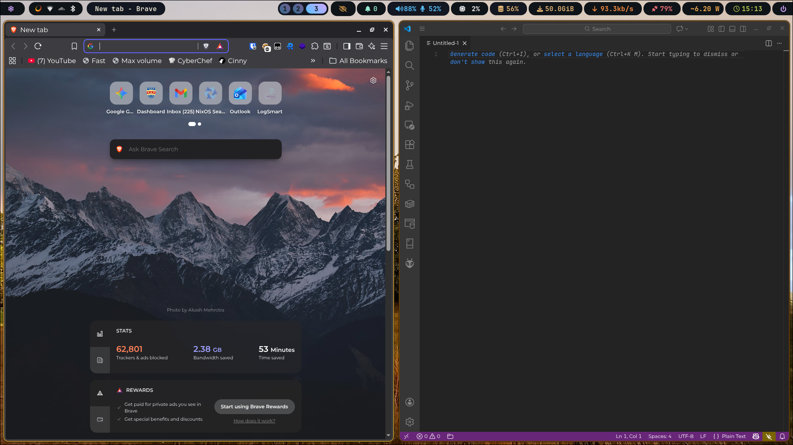
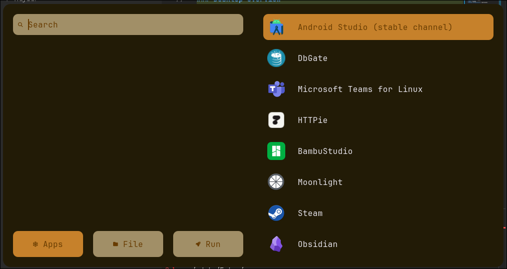
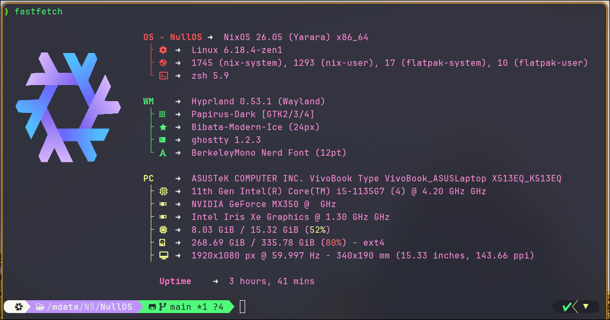

# NullOS

A modern, declarative NixOS configuration featuring Hyprland, comprehensive home-manager integration, and per-machine customization.


*Main desktop environment with Hyprland and Waybar*

---

## 📖 Table of Contents

- [Overview](#overview)
- [Features](#features)
- [Screenshots](#screenshots)
- [System Components](#system-components)
- [Home Manager Applications](#home-manager-applications)
- [Installation](#installation)
- [Configuration](#configuration)
- [Customization](#customization)
- [Managing Secrets](#managing-secrets)
- [Tips & Tricks](#tips--tricks)

---

## Overview

NullOS is a fully declarative NixOS configuration that provides a polished Wayland desktop experience using Hyprland. It leverages Nix flakes for reproducibility and home-manager for user-level configuration management.

**Key Philosophy:**
- **Declarative Everything** - System and user configurations defined in Nix
- **Per-Machine Flexibility** - Easy multi-host management with shared components
- **Modern Desktop** - Wayland-first with Hyprland compositor
- **Developer-Friendly** - Includes dev tools, containers, and virtualization support

---

## Features

✨ **Desktop Environment**
- Hyprland compositor with custom animations
- Waybar status bar with system monitoring
- Rofi application launcher
- SwayNC notification daemon
- SwayOSD for volume/brightness feedback
- Pyprland scratchpads for quick terminal access
- Hyprlock and Hypridle for screen locking

🎨 **Theming**
- Stylix-based system-wide theming
- GTK and Qt theme coordination
- Automatic wallpaper-based color schemes

🔧 **System Services**
- NVIDIA PRIME support with power-efficient specialisation
- Docker and virtualization ready
- VPN support (Tailscale, Mullvad, Cloudflare WARP, Riseup)
- Sunshine game streaming server
- Ollama AI inference server
- Automated backups with Restic

🛠️ **Development Tools**
- Neovim with Nixvim configuration (also NVF available)
- VSCode with Nix integration
- Android Studio and ADB
- Git with GitHub CLI
- Direnv for project environments

🎮 **Gaming**
- Steam with gamemode
- Lutris game launcher
- Moonlight streaming client
- GameMode performance optimizations
- Fusion 360 (via Wine)

---

## Screenshots

### Desktop Overview


### Rofi Application Launcher


### Terminal with Starship Prompt


### Hyprlock Screen Lock


### Waybar Configuration


---

## System Components

These applications are installed system-wide via NixOS configuration:

### Core System
- **Window Manager**: Hyprland
- **Display Manager**: SDDM
- **Shell**: Zsh with Powerlevel10k
- **Editor**: Neovim (default editor)

### System Utilities
- **File Manager**: Dolphin
- **Terminal**: Ghostty
- **Browser**: Configurable (Brave by default)
- **Audio**: PipeWire + Pavucontrol
- **Brightness Control**: brightnessctl
- **Screenshot**: Custom screenshotin script + Swappy
- **Notifications**: SwayNC
- **OSD**: SwayOSD
- **Display Configuration**: nwg-displays

### Multimedia
- **Video Player**: MPV
- **Music Player**: Rhythmbox
- **Image Viewer**: Eye of GNOME (eog)
- **Screen Streaming**: Gnome Network Displays
- **Game Streaming**: Moonlight, Sunshine

### Gaming
- **Game Launcher**: Lutris
- **CAD/Design**: Fusion 360 (via Wine)

### Productivity
- **Notes**: Obsidian
- **Office Suite**: LibreOffice (Configured via office.nix)
- **Database Client**: DbGate
- **HTTP Client**: HTTPie Desktop
- **Torrent Client**: qBittorrent
- **Communication**: Teams for Linux

### Development
- **Containerization**: Docker, Docker Compose
- **Virtualization**: KVM, libvirt
- **Android**: Android Studio, ADB
- **Version Control**: Git, GitHub CLI (gh)
- **AI/ML**: Ollama

### System Monitoring
- **Process Monitor**: btop, bottom
- **Disk Usage**: gdu, dysk, ncdu
- **System Info**: inxi, lshw, lm_sensors
- **Hardware Utils**: pciutils, usbutils, alsa-utils

### Network & Security
- **VPN**: Tailscale, Mullvad, Cloudflare WARP, OpenFortiVPN, Riseup
- **Secrets**: GnuPG, libsecret, Seahorse
- **Firewall**: Managed by NixOS

### File Tools
- **Archive Support**: p7zip, unrar, unzip
- **Binary Analysis**: binwalk, hexdump
- **File Search**: ripgrep, eza
- **Navigation**: zoxide, yazi

### Media Processing
- **Video/Audio**: ffmpeg, sox
- **Wallpapers**: hyprpaper

---

## Home Manager Applications

User-level applications managed via home-manager:

### Shell & CLI
- **Shell**: Zsh with custom configuration
- **Prompt**: Starship
- **File Explorer**: Yazi
- **Directory Jump**: Zoxide
- **Cat Replacement**: Bat
- **Ls Replacement**: Eza
- **Process Monitor**: Bottom
- **Quick Help**: Tealdeer (tldr)
- **Fetch**: Fastfetch

### Desktop Applications
- **Editor**: VSCode, Neovim (Nixvim/NVF)
- **File Manager**: Dolphin (system integration)
- **HTTP Client**: HTTPie Desktop
- **Office Suite**: LibreOffice (via office.nix)
- **Display Config**: nwg-displays
- **Gaming**: Lutris game launcher
- **CAD**: Fusion 360 (via Wine)

### Wayland Utilities
- **Screenshot**: Custom screenshotin script, Swappy
- **Notifications**: SwayNC
- **OSD**: SwayOSD
- **Wallpaper**: Custom wallsetter script
- **Logout Menu**: wlogout

### Development
- **Git**: Configured with credentials
- **GitHub CLI**: gh
- **Direnv**: Automatic environment loading

### Custom Scripts
Located in `home/scripts/`:
- **screenshotin** - Screenshot utility with area selection
- **keybinds** - List all Hyprland keybindings
- **rofi-launcher** - Custom Rofi launcher wrapper
- **wallsetter** - Wallpaper management and setting

---

## Installation

### Prerequisites

1. A working NixOS installation with flakes enabled
2. Git installed
3. Your system hostname and desired username

### Enable Flakes (if needed)

If you haven't enabled flakes, add to `/etc/nixos/configuration.nix`:

```nix
nix.settings.experimental-features = [ "nix-command" "flakes" ];
```

Then rebuild: `sudo nixos-rebuild switch`

### Clone Repository

```bash
git clone https://github.com/nullstring1/NullOS.git ~/NullOS
cd ~/NullOS
```

### Quick Start: Use an Existing Machine Config

NullOS includes pre-configured machines in `machines/`:

- **nslapt** - Laptop (NVIDIA Prime, passwordless sudo, Restic backup, iOS support)
- **nspc** - Desktop (full NVIDIA, Steam enabled)
- **nsminipc** - Headless server (minimal, no desktop environment)

To use an existing config:

```bash
# For nslapt (laptop)
sudo nixos-rebuild switch --flake .#nslapt

# For nspc (desktop)
sudo nixos-rebuild switch --flake .#nspc
```

### Custom Setup: Create Your Machine Configuration

For a new machine, create `machines/yourhostname/default.nix`:

```nix
{
  # User settings
  username = "youruser";
  gitUsername = "Your Name";
  gitEmail = "your@email.com";

  # System settings
  timeZone = "Europe/London";
  locale = "en_GB.UTF-8";
  keyboardLayout = "gb";

  # Optional: Desktop environment (default: "hyprland")
  # desktopEnvironment = "hyprland";  # or "kde" or null for headless

  # Optional: NVIDIA (if applicable)
  # useNvidiaPrime = true;
  # intelBusId = "PCI:0:2:0";
  # nvidiaBusId = "PCI:2:0:0";

  # Optional: Customizations
  # stylixImage = ./wallpapers/screen.jpg;
  # resticRepository = "sftp:user@host:/backup/path";
}
```

Create hardware config:

```bash
# Generate your hardware configuration
sudo nixos-generate-config --show-hardware-config > /tmp/hardware.nix

# Copy template and edit
cp modules/system/hardware_nslapt.nix modules/system/hardware_yourhostname.nix
# Edit the file and paste your hardware config from /tmp/hardware.nix
```

Update `flake.nix` to include your machine. Refer to the existing `nslapt` and `nspc` configurations as templates.

### Build and Switch

```bash
# For custom hostname
sudo nixos-rebuild switch --flake .#yourhostname

# Or use the convenient alias (requires nix develop)
nix develop
fr  # rebuilds current machine (via nh)
```

### First Boot Setup

1. Log out and log back in to apply user environment
2. Set your user password: `passwd`
3. Configure SDDM autologin if desired (see customization)
4. Apply your wallpaper: Run `wallsetter` or place images in `wallpapers/`

---

## Configuration

### Understanding the Configuration Hierarchy

NullOS uses a three-stage configuration system:

1. **Base defaults** (`machines/profiles/base.nix`) - Common settings, most features disabled
2. **Profile config** (`machines/profiles/pc.nix` or `server.nix`) - Sets 20+ features based on machine class
3. **Machine overrides** (`machines/{hostname}/default.nix`) - Per-machine customization

This design allows sharing common configs while easily overriding for individual machines.

### Per-Machine Configuration

Each machine config lives in `machines/{hostname}/default.nix`. This is where you customize:

- **User settings**: `username`, `gitUsername`, `gitEmail`
- **System settings**: `timeZone`, `locale`, `keyboardLayout`
- **Desktop environment**: `desktopEnvironment` ("hyprland", "kde", or null for headless)
- **Hardware**: GPU configuration, monitor settings
- **Features**: Enable/disable Docker, VSCode, Android Studio, Steam, etc.
- **Secrets**: Reference to `machines/{hostname}/secrets.yaml`

Example structure:

```nix
{
  # Identifiers
  username = "nullstring1";
  gitUsername = "Null String";
  gitEmail = "null@example.com";

  # Locale
  timeZone = "Europe/London";
  locale = "en_GB.UTF-8";
  keyboardLayout = "gb";

  # Desktop (optional, defaults to "hyprland")
  desktopEnvironment = "hyprland";

  # GPU (optional, for NVIDIA laptops)
  useNvidiaPrime = true;
  intelBusId = "PCI:0:2:0";
  nvidiaBusId = "PCI:2:0:0";

  # Optional customizations
  stylixImage = ./wallpapers/mywall.jpg;
  resticRepository = "sftp:user@host:/backup";
}
```

### Supported Machines

**nslapt** (Laptop)
- NVIDIA PRIME (Intel iGPU + NVIDIA dGPU)
- Passwordless sudo
- Restic backups enabled
- iOS device support
- Power-efficient specialisation

**nspc** (Desktop)
- Full NVIDIA GPU support
- Steam with gamemode
- High-performance settings
- Distributed build machine setup

**nsminipc** (Headless Server)
- No desktop environment
- Minimal services
- Docker support
- Tailscale VPN

### Desktop Environment Selection

NullOS supports both Hyprland (primary) and KDE (secondary). Set in machine config:

```nix
# Hyprland (default)
desktopEnvironment = "hyprland";

# KDE
desktopEnvironment = "kde";

# Headless (no DE)
desktopEnvironment = null;
```

### Secrets Management

Real secrets (API keys, tokens, backup credentials) use sops-nix with age encryption:

1. Create `machines/{hostname}/secrets.yaml` with encrypted secrets
2. NixOS decrypts at system activation using age key at `~/.config/sops/age/keys.txt`
3. Access in configs via `config.sops.secrets.secretname.path`

Example secrets:
- `githubToken` - For GitHub CLI access
- `nextdnsServerName`, `nextdnsStamp` - If NextDNS enabled
- `resticRepository` - Backup target credentials

See `.sops.yaml` for encryption rules matching `machines/.*/secrets.yaml`.

### Build Aliases

Convenient shell aliases (defined in `home/zsh/default.nix`):

```bash
fr   # nh os switch --hostname {hostname}
     # Fast rebuild current machine

fu   # nh os switch --hostname {hostname} --update
     # Rebuild with flake input updates

ncg  # Garbage collection + bootloader cleanup + home-manager generations
```

To use these, enter the dev shell first:

```bash
nix develop
fr  # Now you can use the alias
```

---

## Customization

### Changing Themes

NullOS uses Stylix for automatic theming based on wallpapers.

1. Add your wallpaper to `wallpapers/`
2. Update your machine config (`machines/{hostname}/default.nix`):
```nix
stylixImage = ./wallpapers/yourwallpaper.jpg;
```
3. Rebuild: `fr` or `sudo nixos-rebuild switch --flake .#yourhostname`

### Adding Applications

#### System-Level Applications

Edit `modules/software/packages.nix`:

```nix
environment.systemPackages = with pkgs; [
  # Add your package here
  newpackage
];
```

#### Home-Manager Applications

Create a new file in `home/` or add to existing configuration:

```nix
# home/myapp.nix
{ pkgs, ... }:
{
  home.packages = [ pkgs.myapp ];
}
```

Then import in `home/default.nix`:

```nix
imports = [
  # ... existing imports
  ./myapp.nix
];
```

### Customizing Hyprland

#### Keybindings

Edit `home/hyprland/binds.nix`:

```nix
bind = [
  "SUPER,X,exec,yourcommand"  # Add your keybind
];
```

View current keybinds: Press `SUPER+K` or run `keybinds`

#### Animations

Change animation style by updating your machine config:

```nix
# In machines/{hostname}/default.nix (optional, defaults to animations-end4)
# animationSet = ./home/hyprland/animations-yourname.nix;
```

#### Window Rules

Edit `home/hyprland/windowrules.nix`:

```nix
windowrule = [
  "match:class (myapp), float on"  # Add custom window rules
];
```

#### Monitor Configuration

Monitor config can be handled at runtime with `nwg-displays` (F8 key), or declaratively:

Edit your machine config:

```nix
# In machines/{hostname}/default.nix
extraMonitorSettings = ''
  monitor = DP-1, 2560x1440@144, 0x0, 1
  monitor = HDMI-A-1, 1920x1080@60, 2560x0, 1
'';
```

### Customizing Waybar

Edit `home/waybar/default.nix` to modify the status bar layout, modules, and appearance.

### Adding Scratchpads

Edit `home/hyprland/pyprland.nix`:

```nix
[scratchpads.myapp]
animation = "fromTop"
command = "myapplication"
size = "70% 70%"
max_size = "1920px 100%"
```

Bind in `home/hyprland/binds.nix`:

```nix
"SUPER,A,exec,pypr toggle myapp"
```

### Shell Customization

#### Zsh Configuration

Edit `home/zsh/zshrc-personal.nix` for custom shell aliases and functions.

#### Powerlevel10k Prompt

Customize prompt: `home/zsh/p10k-config/p10k.zsh`

Or run the configuration wizard:
```bash
p10k configure
```

### Neovim Configuration

NullOS uses Nixvim as the primary Neovim configuration. Edit `home/nixvim.nix` to customize your editor. An alternative NVF configuration is also available in `home/nvf.nix`.

### Git Configuration

Set your git identity in your machine config:

```nix
# In machines/{hostname}/default.nix
gitUsername = "Your Name";
gitEmail = "your@email.com";
```

Additional git config can be added in `home/git.nix`.

---

## Managing Secrets

### Per-Machine Secrets

Real secrets (API keys, backup credentials, etc.) are encrypted using sops-nix with age encryption.

**Setup (first time):**

1. Generate age keys:
```bash
mkdir -p ~/.config/sops/age
age-keygen -o ~/.config/sops/age/keys.txt
```

2. Create `machines/{hostname}/secrets.yaml` with your secrets:
```yaml
githubToken: your-secret-token
resticPassword: your-backup-password
nextdnsServerName: your.server.name
```

3. Encrypt with sops (automatic via `.sops.yaml` rules):
```bash
sops machines/yourhostname/secrets.yaml
```

4. Reference in your machine config or modules using `config.sops.secrets.secretname.path`

**Secrets are automatically:**
- Encrypted at rest (age encryption)
- Stored in git safely
- Decrypted during system activation
- Made available to services

### Impure Mode (if needed)

Some configurations may require `--impure` flag during development:

```bash
sudo nixos-rebuild switch --flake .#yourhostname --impure
```

However, with the sops-nix secrets system, you typically don't need this flag.

---

## Tips & Tricks

### Useful Commands

```bash
# Enter dev shell (provides aliases and build tools)
nix develop
direnv allow  # Auto-activate on cd (if using direnv)

# Rebuild system (flake reload) 
fr # = nh os switch --hostname {hostname}

# Update flake inputs and rebuild
fu # = nh os switch --hostname {hostname} --update

# Garbage collection
ncg # = nix-collect-garbage --delete-old && sudo nix-collect-garbage -d && bootloader cleanup

# Validate flake
nix flake check

# List generations
sudo nix-env --list-generations --profile /nix/var/nix/profiles/system

# Rollback to previous generation
sudo nh os rollback

# Home manager switch (standalone)
home-manager switch --flake .
```

### Hyprland Keybinds Quick Reference

Press `SUPER+K` to view all keybindings, or check [home/hyprland/binds.nix](home/hyprland/binds.nix).

**Essential bindings:**
- `SUPER+Return` - Terminal
- `SUPER+SHIFT+Return` - App launcher
- `SUPER+W` - Browser
- `SUPER+E` - File manager
- `SUPER+S` - Screenshot
- `SUPER+C` - VSCode
- `SUPER+T` - Scratchpad terminal
- `SUPER+Q` - Close window
- `SUPER+SHIFT+C` - Exit Hyprland

### NVIDIA Power Management

For laptops with NVIDIA GPUs:

**Boot into power-efficient mode:**
Select "power-efficient" from GRUB menu, or:
```bash
sudo nixos-rebuild boot --flake .#nslapt --specialisation power-efficient
sudo reboot
```

**Check current GPU:**
```bash
glxinfo | grep "OpenGL renderer"
```

### Backup and Restore

The system includes Restic backup configuration. Configure in your machine config:

```nix
# In machines/{hostname}/default.nix
resticRepository = "sftp:user@host:/backup/path";
```

Service is defined in `modules/services/backup.nix`.

### Cleaning Up

```bash
# Remove old generations
ncg

nh clean all

# Remove old home-manager generations
home-manager expire-generations "-7 days"
```

### Updating

```bash
# Update all flake inputs
fu
# or 
nix flake update

# Update specific input
nix flake lock --update-input nixpkgs

# Rebuild with updates
sudo nixos-rebuild switch --flake .#yourhostname
# or
fr
# or 
nh os switch --flake .#yourhostname
```

### Troubleshooting

**System won't boot:**
- Select previous generation from GRUB menu
- Or boot from NixOS installer and rollback

**Home manager conflicts:**
- Check `~/.config/` for files that need manual removal
- Home manager backup files have `.backup` extension

**Build errors:**
- Check syntax with `nix flake check`
- Review error messages for missing imports or syntax errors
- Ensure all required files are staged in git (or use `--impure`)

**NVIDIA issues:**
- Check `nvidia-smi` output
- Review NVIDIA module in `modules/system/nvidia.nix`
- Try power-efficient specialisation

---

## Contributing

Feel free to fork this configuration and make it your own! If you find bugs or have improvements, pull requests are welcome.

## License

This configuration is provided as-is for personal use and modification.

---

## Credits

Built with:
- [NixOS](https://nixos.org/)
- [Home Manager](https://github.com/nix-community/home-manager)
- [Hyprland](https://hyprland.org/)
- [Stylix](https://github.com/danth/stylix)
- [NVF](https://github.com/notashelf/nvf)

Original inspiration:
- [Zaneyos](https://gitlab.com/Zaney/zaneyos)

---

**Enjoy your NullOS experience! 🚀**
